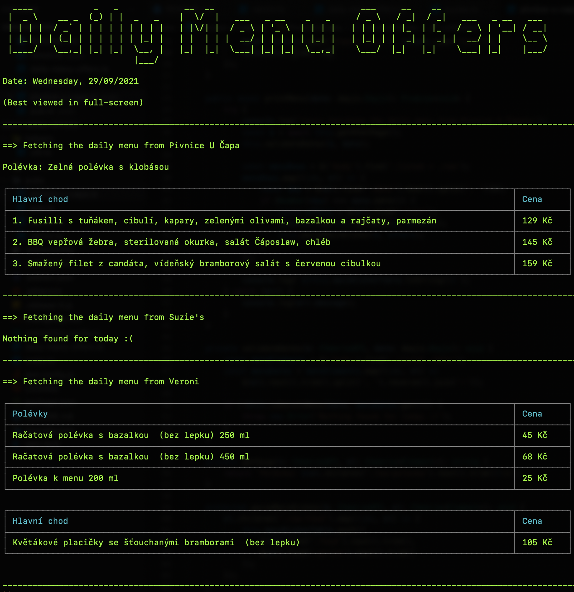

# Daily Menu Offers

What are my favourite pubs/restaurants serving today?

Every pub presents information about its daily or weekly menu somewhere on the web.
This script finds out and presents information about what each of the restaurants below is cooking today (it also includes soups).
The information is printed to the console.

It's good to know what's being cooked when you don't know what you're craving.

## Running

- Install yarn if you don't have it
- Run the command to install the packages:

```bash
yarn install
```

- Run the script:

```bash
yarn start
```

Example output:



## Pubs

- [Pivnice U Čapa](https://www.pivnice-ucapa.cz/denni-menu.php)
- [Suzie's Steak Pub](http://www.suzies.cz/poledni-menu)
- [Veroni Cafe](https://www.menicka.cz/4921-veroni-coffee--chocolate.html)